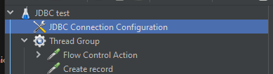
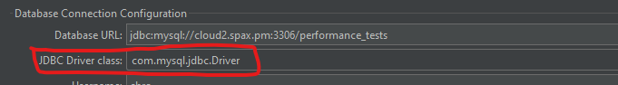
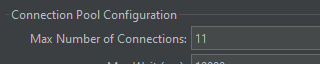
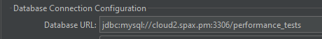
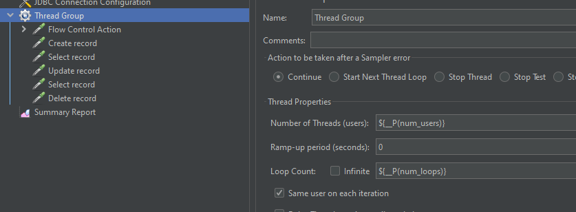

# DB_perf

Test DB performances through a JMeter test plan.  
Test plan TEST_JMX is executed NUM_LOOPS times, with NUM_USERS concurrent users.  
Synthetic result OUT_JSON is the sum of the elapsed time of each operation.

## Requirements

- Apache Jmeter and dependencies (Java 8) installed: https://jmeter.apache.org/download_jmeter.cgi
- `xsltproc` for result extraction

## Specific files

- `JDBC_test.jmx`: JMeter test plan. This sample can be used as a base for more specific tests. Preferably, it is meant to be edited through the JMeter GUI, but simple values can also be directly edited in the (xml) file.

## Setup

### Database

A database must be available for performance testing, whether existing or created specifically, and credentails be available.  
In the sample test plan provided for MySQL, a `performance_tests` is used, upon which a `test_table` table is created and deleted for the tests.

### JDBC driver

JMeter is a java application, and is using JDBC to access databases.  
In order to use JDBC, drivers must be downloaded from the database makers (e.g. Oracle).  

The included example uses a MySQL database whose class name is "com.mysql.jdbc.Driver". It must be specified inside the .jmx file.

```xml
        <stringProp name="driver">com.mysql.jdbc.Driver</stringProp>
```




The associated jar file(s) (e.g. "mysql-connector-java-5.1.48.jar") must placed in the JMeter installation tree, in "lib/ext" (e.g. "/opt/apache-jmeter-5.5/lib/ext")

### Important parameters

#### JDBC pool size 

Pool of connections objects

```xml
        <stringProp name="poolMax">11</stringProp>
```



#### JDBC database url 

The url pointing to the database to be tested. This is database dependant, and the format will be specified in the documentation of the JDBC driver.

- MySQL example

```xml
        <stringProp name="dbUrl">jdbc:mysql://cloud2.spax.pm:3306/performance_tests</stringProp>
```



- Oracle example

```xml
        <stringProp name="dbUrl">jdbc:oracle:thin:@cloud2.spax.pm:1521:performance_tests</stringProp>
```

#### Number of users and Number of loops

Define the number of users (threads) and the number of times the sequence of actions will be executed for each user.  
Those parameters are passed to JMeter from the command-line invocation in the provided sample.

The parameters are passed using the `-J` CLI option, ex:

```
[...]jmeter.sh [...] -Jnum_users=100 -Jnum_loops=10 [...]
```

Those parameters are used in the the jmx file with the `${__P(<var_name>)}` syntax, eg:

```xml
        <elementProp name="ThreadGroup.main_controller" elementType="LoopController" guiclass="LoopControlPanel" testclass="LoopController" testname="Loop Controller" enabled="true">
          <boolProp name="LoopController.continue_forever">false</boolProp>
          <stringProp name="LoopController.loops">${__P(num_loops)}</stringProp>
        </elementProp>
        <stringProp name="ThreadGroup.num_threads">${__P(num_users)}</stringProp>
```


